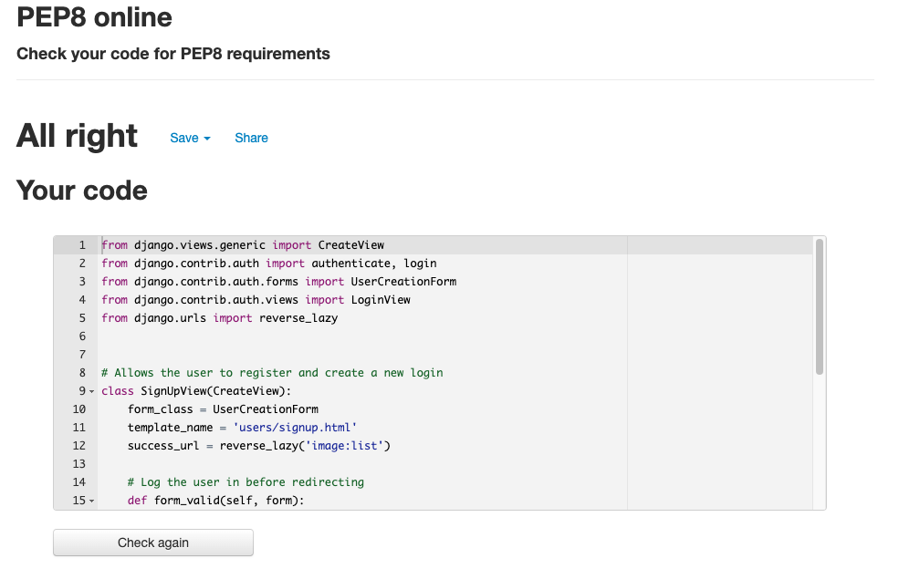

# Photography Website

[Live Website](https://pp4-photoshare.herokuapp.com/)

## Table Of Contents

1. [Project Goals](#project-goals)
    1. [Site Owner Goals](#site-owner-goals)
    2. [User Goals](#user-goals)
2. [Information Gathering](#information-gathering)
    1. [Target Audience](#target-audience)
    2. [User Requirements](#user-requirements)
    3. [User Stories](#user-stories)
3. [Site Design](#site-design)
    1. [Wireframes](#wireframes)
    2. [Design choice](#design-choice)
4. [Technical Design](#technical-design)
    1. [Database Model](#database-model)
5. [Site Features](#site-features)
    1. [Home](#home)
    2. [Booking](#booking)
    3. [Community](#community)
    4. [Community Login](#community-login)
    5. [Community Signup](#community-signup)
    6. [404 Error Page](#404-error-page)
6. [Technology Stack](#technology-stack)
    1. [Languages](#languages)
    2. [Frameworks And Tools](#frameworks-and-tools)
7. [Testing](#testing)
    1. [Validation](#validation)
    2. [Performance](#performance)
    3. [Accessibility](#accessibility)
    4. [Compatibility](#compatibility)
    5. [User Stories Testing](#user-stories-testing)
8. [Bugs And Fixes](#bugs-and-fixes)
9. [Deployment And Version Control](#deployment-and-version-control)
    1. [Deployment](#deployment)
    2. [Cloning](#cloning)
    3. [Version Control](#version-control)
10. [Credits](#credits)
11. [Assets Used](#assets-used)
12. [Acknowledgements](#acknowledgements)

## Project Goals

### Site Owner Goals
* To have a simple to navigate website to attract business
* Allow users to book a session and get in contact
* Provide a community to customers

### User Goals
* To view photographers and other peoples photographs
* To be able to make a booking
* Contact the photographer

## Information Gathering

### Target Audience
* People who want to have portraits taken of themselves or family
* Pet owners who want photos of their pet taken
* People who hold an interest in photography and want to share their pictures
* Companies who want commercial photos taken

### User Requirements
* Easy to navigate website
* Website works as expected
* The ability to add, create and remove photographs
* Accessible to users
* Visually appealing website to instil confidence

### User Stories

No. | As a | I want to | so that
----|------|-----------|--------
1 | New User | view information about the photographer | I can see what experience the photographer has and learn about their style.
2 | New User | see the photographers work | I can see if photographers style fits my needs for booking.
3 | New User | easy navigate the website | I can have a good experience and find what I require.
4 | New User | be able to contact the photographer | I can get my queries answered.
5 | New User | be able to make a booking | I can have photoshoot and pictures taken.
6 | New User | be able to make an account | I can join the community page.
7 | Existing User | be able to upload, edit, delete and share images | I can actively partake in the community and remove post if mistakenly uploaded.
8 | Existing User | log into my account | I can continue to post in the community.
9 | Existing User | upload, edit and delete photos | I can have a social presence in the community and control over my contribution.
10 | Existing User | book an appointment | to have photos taken.
11 | Existing User | get in contact with photographer | I can follow up any bookings or add special requests.
12 | Site Owner | have my previous work on show | customers can form an opinion on my style of photography and if it matches what they are after.
13 | Site Owner | have an error page | when a customer navigates to a non existent page a 404 error is presented.
14 | Site Owner | have a community page | customers can partake in sharing their photos and feel involved.
15 | Site Owner | have a booking page | I can increase business sales and offer a more automated approach at scheduling appointments.

## Site Design

### Wireframes

Home Page

Booking Page

Community Page

Community - Login Page

Community - Signup Page

404 Error Page

### Design Choice

#### Layout
The layout for the website is intended to be clean and very simple for users to be able to view and navigate free of distracting elements. The website is easy to navigate and consists of 6 pages. 

#### Fonts
The fonts used are the pairing of Roboto Medium and Noto Sans as they are easy to read and have simple typography which compliments the clean asthetic of the website.

#### Colours
The colour scheme consists of whites, greys, greens and blues. The main colour being white for the clean background and then dark grey used to seperate the navbar from the body with green accents.

## Technical Design

### Database Model
The below database model contains the fields for what is stored in the database collection along with the data type for each field.

Database Model

## Site Features
The website consists of 5 different pages where the user will be taken to a landing page on arrival giving information about the site owner, the ability to fill in a contact form and then provided with the opportunity to link to a booking and community page. The website is structured with the following pages.

### Home
This is the landing page which the user will be first taken to. On this page is displayed a hero image, information about the siteowner followed by a contact form for users to be able to contact the siteowner.

### Booking
This page consists of a booking form where users will be able to book in an appointment with a photographer to have their pictures taken.

### Community page
This page features a photo sharing application where the user can see a grid of images uploaded by the community. The user can click the Login button in the top right corner situated on the navbar in order to log into their account to begin uploading their own images. 

### Community Login
This page features a user login form where an existing user can put in their username and password to access their account. There is also a clickable link for new users to be able to register and create an account.

### Community Signup
This page features a signup form where a new user can register their username and password to create an account so that they can then begin creating photos, update their photo information and also able to delete their photo.

### 404 Error page
This page features a 404 Error message when user navigates to a page that doesnt exist. The user will have the ability to be redirected back to the landing page.

## Technology Stack

### Languages
* HTML
* CSS
* JavaScript
* Python

### Database
* Postgresql

### Frameworks And Tools
* Django
* Bootstrap
* Heroku Cloud Application
* Gunicorn
* Taggit
* Psycopg2 adaptor
* Cloudinary
* Git
* Github
* Gitpod
* Balsamiq wireframes
* Font Awesome
* Chrome DevTools
* Chrome Lighthouse
* WAVE WebAIM accessibility evaluation
* W3C Markup Validation
* PEP8 Online Validation Service
* EmailjS

## Testing

### Validation

#### HTML Validation
The W3C markup validation service was used in order to check the validation of the HTML on the website. Most pages passed without errors. One error was returned from within Djangos crispy-forms. When validating the update and delete views the pages returned with a 403 error.

Community Page

Login Page

Signup Page

Image Delete Page

Image Update Page

 

#### PEP8 Validation
The PEP8 online validation tool was used to validate the python code for the views.py, urls.py and models.py for the project and apps

Community models.py

Community urls.py

Community views.py

Users urls.py

Users views.py

 

### Performance
Googles Chrome Developer Lighthouse Tool was used in order to test and analyse the performance of the website.

Lighthouse Performannce

 

### Accessibility
The WAVE WebAIM accessibility evaluation tool was used to analyse the website ensuring that it met accessibility standards. There were no errors reported on any of the tests ran.

Community

Login

Signup

Create

 

### Compatibility
The compatibility of the website was tested on a few devices ranging from desktop, mobile and tablets. Google Chrome Developer Tools device toggling was also used. The physical devices that were used for testing are as followed:
* Apple IPhone SE
* Apple Ipad Pro
* Huawei Mate 20 Pro
* Apple Macbook

### User Stories Testing
Testing of the User Stories which had been identified towards the top of the README. Not all user stories were able to be tested due to certain features on the website have not yet been created due to timing constraints. Features to be added. Aforementioned user stories and features are as follows:
>  No. | As a | I want to | so that
>  ----|------|-----------|--------
>  1 | New User | view information about the photographer | I can see what experience the photographer has and learn about their style.
Site Feature | Path of Action | Outcome | Testing Result
-------------|----------------|---------|----------------
Landing page | scroll down to information about photographer | unable to test, not yet built | N/A.
 

>  No. | As a | I want to | so that
>  ----|------|-----------|--------
>  2 | New User | see the photographers work | I can see if photographers style fits my needs for booking.
Site Feature | Path of Action | Outcome | Testing Result
-------------|----------------|---------|----------------
Landing page | scroll down to example images from portfolio | unable to test, not yet built | N/A
Community Photoshare | scroll through grid of images to see some of photographers work alongside community users | viewed photographs uploaded by site admin | worked as expected.
 

>  No. | As a | I want to | so that
>  ----|------|-----------|--------
>  3 | New User | easy navigate the website | I can have a good experience and find what I require.
Site Feature | Path of Action | Outcome | Testing Result
-------------|----------------|---------|----------------
Community page | scroll through page and click on images to be taken to a detailed view | On clicking images, further information was displayed | worked as expected.
 

>  No. | As a | I want to | so that
>  ----|------|-----------|--------
>  4 | New User | be able to contact the photographer | I can get my queries answered.
Site Feature | Path of Action | Outcome | Testing Result
-------------|----------------|---------|----------------
Contact form | On landing page scroll down to contact form at bottom of page | Unable to test not yet built | N/A.
 

>  No. | As a | I want to | so that
>  ----|------|-----------|--------
>  5 | New User | be able to make a booking | I can have photoshoot and pictures taken.
Site Feature | Path of Action | Outcome | Testing Result
-------------|----------------|---------|----------------
Booking Form | navigate to the booking page to access form | unable to test, not yet built | N/A.
 

>  No. | As a | I want to | so that
>  ----|------|-----------|--------
>  6 | New User | be able to make an account | I can join the community page.
Site Feature | Path of Action | Outcome | Testing Result
-------------|----------------|---------|----------------
Create account | navigate to log in at the top of the navbar, greeted with message asking Not Yet Registered? Create an account | clicked linked to create an account and was taken to a registration form to create a username and password | worked as expected.
 

>  No. | As a | I want to | so that
>  ----|------|-----------|--------
>  7 | New User | be able to upload, edit, delete and share images | I can actively partake in the community and remove post if mistakenly uploaded.
Site Feature | Path of Action | Outcome | Testing Result
-------------|----------------|---------|----------------
CRUD functionality | click login at top in navbar, proceed to create account, on completion then go to add image at the top in the navbar. | On clicking taken to a page with a image creation form where the title, description and tags can be input when uploading image. After upload can click into image for detailed view where image can then be edited or deleted. | worked as expected.
 

>  No. | As a | I want to | so that
>  ----|------|-----------|--------
>  8 | Existing User | log into my account | I can continue to post in the community.
Site Feature | Path of Action | Outcome | Testing Result
-------------|----------------|---------|----------------
Login button | navigate up to the navbar and click Login button | taken to a screen where there is an opportunity to enter credentials for username and password | worked as expected.
 

>  No. | As a | I want to | so that
>  ----|------|-----------|--------
>  9 | Existing User | upload, edit and delete photos | I can have a social presence in the community and control over my contribution.
Site Feature | Path of Action | Outcome | Testing Result
-------------|----------------|---------|----------------
CRUD functionality | click login at the top in navbar, enter user credentials to login. Click add image at the top in the navbar. | On clicking taken to a page with a image creation form where the title, description and tags can be input when uploading image. After upload can click into image for detailed view where image can then be edited or deleted. | worked as expected.
 

>  No. | As a | I want to | so that
>  ----|------|-----------|--------
>  10 | Existing User | book an appointment | to have photos taken.
Site Feature | Path of Action | Outcome | Testing Result
-------------|----------------|---------|----------------
Booking form | navigate to booking page | unable to test, not yet built | N/A.
 

>  No. | As a | I want to | so that
>  ----|------|-----------|--------
>  11 | Existing User | get in contact with photographer | I can follow up any bookings or add special requests.
Site Feature | Path of Action | Outcome | Testing Result
-------------|----------------|---------|----------------
Contact form | on landing page, scroll down to bottom for contact form | unable to test, not yet built | N/A.
 

>  No. | As a | I want to | so that
>  ----|------|-----------|--------
>  12 | Site Owner | have my previous work on show | customers can form an opinion on my style of photography and if it matches what they are after.
Site Feature | Path of Action | Outcome | Testing Result
-------------|----------------|---------|----------------
Landing page | scroll down to grid of images displaying work from portfolio | unable to test, not yet created | N/A.
Community Photoshare | navigate to community page and log into account | able to view siteowner shared photos uploaded with the community | worked as expected.
 

>  No. | As a | I want to | so that
>  ----|------|-----------|--------
>  13 | Site Owner | have an error page | when a customer navigates to a non existent page a 404 error is presented.
Site Feature | Path of Action | Outcome | Testing Result
-------------|----------------|---------|----------------
404 error page | append incorrect url to web address | taken to a 404 error page | worked as expected.
 

>  No. | As a | I want to | so that
>  ----|------|-----------|--------
>  14 | Site Owner | have a community page | customers can partake in sharing their photos and feel involved.
Site Feature | Path of Action | Outcome | Testing Result
-------------|----------------|---------|----------------
Photoshare app | navigate to community page or by logging in | grid display of user uploaded photographs shown where you can click into the image and get a detailed view of each image | worked as expected.
 

>  No. | As a | I want to | so that
>  ----|------|-----------|--------
>  15 | Site Owner | have a booking page | I can increase business sales and offer a more automated approach at scheduling appointments.
Site Feature | Path of Action | Outcome | Testing Result
-------------|----------------|---------|----------------
Booking form | navigate to booking page to fill in booking form | unable to test, not yet created | N/A
 

## Bugs And Fixes
BUG | FIX
----|----
Couldn't deploy on Heroku. | By default Heroku was using an older version of python. Added runtime.txt to root with python version 3.9.13.
ModuleNotFoundError when trying to make migration. | Commented out import on url.py and eventually proceeded to removing unused import.
Forbidden 403 CSRF validation failed when trying to log into admin panel. | Added CSRF_TRUSTED_ORIGINS = ['https://8000-hardingrich-pp4photogra-p4va6psc8s3.ws-eu63.gitpod.io', 'http://127.0.0.1:8000/'] to validate token access.
Syntax Error when loading manage.py runserver. | Missing comma between path route and view.
NameError when migrating or running server, LoginView not defined. | Added views import for LoginView.
django.db.utils.ProgrammingError: relation "community_photoshare" akready exists. | Had to do an initial --fake migrate to push the data through.
Fatal: no pg_hba.conf entry for host "104.155.105.59", user "lfrourpqudtvoz", database "dckjej6qk5ebu7", no encryption. Relating to Heroku Postgres config settings. | Temporary fix of commenting out database variable. Later fixed by updating the user and database URL for Heroku Postgres in the env.py file.
runserver wouldnt run, django.core.exceptions.improperlyConfigured: You're using the static files app without having set the required STATIC_URL setting. | Static variablles had accidentally been removed. Added default values from django documentation.
SyntaxError django.template.exceptions.TemplateSyntaxError: Invalid blocktag line 13. | This was due to a typein error, changed to  as missing f.
TemplateSyntaxError: Invalid block tag on line 12: endblock. Did you forget to register or load this tag? - taglist.html | Left a gap between { and % which threw out the error.
NoReverseMatch at /image/4/delete reverse for detail with arguments '("")' not found. 1 pattern tried: ['image/(?P<pk>[0-9]+)^\Z']. | Added context_object_name = 'image' to PhotoshareDeleteView as no object was being referenced to when using image.id.

## Deployment And Version Control

### Deployment
To deploy your application to Heroku please complete the following:

1. Create an account at heroku.com
2. Create a new app 
3. Add the app name and your region
4. Click on create App
5. Go to "Settings"
6. Under Config Vars, add the key: PORT and the value: 8000.
7. Go to "Deploy" and at "Deployment method", click on "Connect to Github"
8. Enter your repository name and click on it when it shows below
9. Choose the branch you want to build your app from
10. If desired, click on "Enable Automatic Deploys", which keeps the app up to date with your Github repository

### Cloning
If you wish to clone the repository you can do so by [clicking here](https://docs.github.com/en/repositories/creating-and-managing-repositories/cloning-a-repository) or completing the following:
1. Locate and click on the Code button at the top of the directory within the GitHub repository
2. This will drop down the option of HTTPS, SSH, and GitHub CLI and the option to open with GitHub Desktop or Download ZIP. Choose the option you prefer and click the copy to clipboard button
3. Open the Git bash terminal
4. Choose the working directory location to where you wish to have the cloned directory.
5. Type "git clone" followed by pasting the URL you copied in step 2.
6. Press Enter to complete and create your local clone.

### Version Control
[Click here](https://github.com/hardingrichard/pp4-photography-website/commits/main) to explore the history of the creation process and see what the code looked like at different points in time and what changes were made. Regular commits were made to make it easier to view the thought process during the creation of the application and readme and also have saved backup points to avoid loss of work in case of any serious malfunctions.

## Credits
* Stackoverflow CSRF verification fix - https://stackoverflow.com/questions/70285834/forbidden-403-csrf-verification-failed-request-aborted-reason-given-for-fail/70326426#70326426
* Stackoverflow Heroku Build error backports.zoneinfo - https://stackoverflow.com/questions/71712258/error-could-not-build-wheels-for-backports-zoneinfo-which-is-required-to-insta
* Stackoverflow rolling back a git repository - https://stackoverflow.com/questions/4114095/how-do-i-revert-a-git-repository-to-a-previous-commit
* Stackoverflow NoReverseMatch error - https://stackoverflow.com/questions/38390177/what-is-a-noreversematch-error-and-how-do-i-fix-it
* Code Institute I Think Therefore I Blog - Code to link app to heroku and Cloudinary
* Classy Class-Based Views for help with views.py and templates - https://ccbv.co.uk/
* Building a Photo-sharing App article - https://www.sitepoint.com/django-photo-sharing-app/
* Tutorial to help set up a Django app and structure - https://www.udemy.com/course/django-3-make-websites-with-python-tutorial-beginner-learn-bootstrap/learn/lecture/17848338?start=0#overview
* Official Django documentation Tutorial - https://docs.djangoproject.com/en/4.1/intro/tutorial01/
* Stackoverflow images not displaying from models - https://stackoverflow.com/questions/66203883/cant-display-images-from-models-when-debug-false
* Deploying a django app - https://www.youtube.com/watch?v=HgDEFnMV16k
* Django crispy-forms documentation - https://django-crispy-forms.readthedocs.io/en/latest/crispy_tag_forms.html?highlight=horizontal#bootstrap3-horizontal-forms
* Bootstrap documentation - https://getbootstrap.com/docs/5.0/layout/columns/

## Assets Used
* Architecture Photo - Unsplash https://unsplash.com/photos/w4272zlbs2s
* Mountains Photo - Unsplash https://unsplash.com/photos/eOzXTfex0n0
* Horse Photo - Unsplash https://unsplash.com/photos/BGohiTIBAcE
* Dog Photo - Unsplash https://unsplash.com/photos/Y8-93C-5rnM
* Waterfall Photo - Unsplash https://unsplash.com/photos/u5gT6ZcIEgw
* City Photo - Unsplash https://unsplash.com/photos/uLi1S6O6Ip4
* Plant Photo - Unplash https://unsplash.com/photos/b_sQrSo3zgs

## Acknowledgments
I would like to give my thanks to the users of stackoverflow whos issues and solutions have allowed me to fix bugs and advance my project. My mentor Mo Shami for his feedback and my friends who helped test the deployed version.