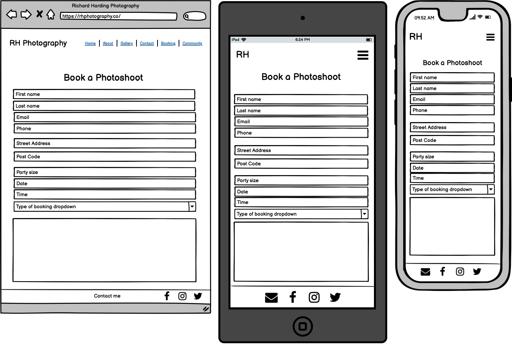

# Photography Website

[Live Website](https://pp4-photoshare.herokuapp.com/)

## Table Of Contents

1. [Project Goals](#project-goals)
    1. [Site Owner Goals](#site-owner-goals)
    2. [User Goals](#user-goals)
2. [Information Gathering](#information-gathering)
    1. [Target Audience](#target-audience)
    2. [User Requirements](#user-requirements)
    3. [User Stories](#user-stories)
3. [Site Design](#site-design)
    1. [Wireframes](#wireframes)
    2. [Design choice](#design-choice)
4. [Technical Design](#technical-design)
    1. [Database Model](#database-model)
5. [Site Features](#site-features)
    1. [Home](#home)
    2. [Booking](#booking)
    3. [Community](#community)
    4. [Community Login](#community-login)
    5. [Community Signup](#community-signup)
    6. [404 Error Page](#404-error-page)
6. [Technology Stack](#technology-stack)
    1. [Languages](#languages)
    2. [Frameworks And Tools](#frameworks-and-tools)
7. [Testing](#testing)
    1. [Validation](#validation)
    2. [Performance](#performance)
    3. [Accessibility](#accessibility)
    4. [Compatibility](#compatibility)
    5. [User Stories Testing](#user-stories-testing)
8. [Bugs And Fixes](#bugs-and-fixes)
9. [Deployment And Version Control](#deployment-and-version-control)
    1. [Deployment](#deployment)
    2. [Cloning](#cloning)
    3. [Version Control](#version-control)
10. [Credits](#credits)
    1. [External Code](#external-code)
    2. [Assets Used](#assets-used)
11. [Acknowledgements](#acknowledgements)

## Project Goals

### Site Owner Goals
* To have a simple to navigate website to attract business
* Allow users to book a session and get in contact
* Provide a community to customers

### User Goals
* To view photographers and other peoples photographs
* To be able to make a booking
* Contact the photographer

## Information Gathering

### Target Audience
* People who want to have portraits taken of themselves or family
* Pet owners who want photos of their pet taken
* People who hold an interest in photography and want to share their pictures
* Companies who want commercial photos taken

### User Requirements
* Easy to navigate website
* Website works as expected
* The ability to add, create and remove photographs
* Accessible to users
* Visually appealing website to instil confidence

### User Stories

No. | As a | I want to | so that
----|------|-----------|--------
1 | New User | view information about the photographer | I can see what experience the photographer has and learn about their style.
2 | New User | see the photographers work | I can see if photographers style fits my needs for booking.
3 | New User | easy navigate the website | I can have a good experience and find what I require.
4 | New User | be able to contact the photographer | I can get my queries answered.
5 | New User | be able to make a booking | I can have photoshoot and pictures taken.
6 | New User | see where the photographer is based | I can see if local and feasible for travel.
7 | New User | see the photographers social media presence | I can get an idea of how reputable the photographer is.
8 | New User | be able to make an account | I can join the community page.
9 | New User | be able to make to navigate back to home page should site error occur | I can continue my browsing with ease.
10 | Existing User | be able to upload, edit, delete and share images | I can actively partake in the community and remove post if mistakenly uploaded.
11 | Existing user | see what services are offered | see what best suits my needs
12 | Existing User | log into my account | I can continue to post in the community.
13 | Existing User | upload, edit and delete photos | I can have a social presence in the community and control over my contribution.
14 | Existing User | book an appointment | to have photos taken.
15 | Existing User | get in contact with photographer | I can follow up any bookings or add special requests.
16 | Site Owner | have information about me available for customers | customers can get an idea of me and my business.
17 | Site Owner | have my previous work on show | customers can form an opinion on my style of photography and if it matches what they are after.
18 | Site Owner | have an easy to navigate website | customers don't become frustrated and leave site.
19 | Site Owner | have an error page | when a customer navigates to a non existent page a 404 error is presented.
20 | Site Owner | have a community page | customers can partake in sharing their photos and feel involved.
21 | Site Owner | have a contact page | customers can raise any queries and get in touch with me.
22 | Site Owner | have a booking page | I can increase business sales and offer a more automated approach at scheduling appointments.

## Site Design

### Wireframes

Home Page

About Page

Gallery Page

Contact Page

Booking Page

Community Page

Community - Logged Out Page

Community - Logged In Page

404 Error Page

### Design Choice

#### Layout
The layout for the website is intended to be clean and very simple for users to be able to view and navigate free of distracting elements. The website is easy to navigate and consists of 6 pages. 

#### Fonts
The fonts used are the pairing of Roboto Medium and Noto Sans as they are easy to read and have simple typography which compliments the clean asthetic of the website.

#### Colours
The colour scheme consists of whites, greys, greens and blues. The main colour being white for the clean background and then dark grey used to seperate the navbar from the body with green accents.

## Technical Design

### Database Model
The below database model contains the fields for what is stored in the database collection along with the data type for each field.

Database Model

## Site Features
The website consists of 5 different pages where the user will be taken to a landing page on arrival giving information about the site owner, the ability to fill in a contact form and then provided with the opportunity to link to a booking and community page. The website is structured with the following pages.

### Home
This is the landing page which the user will be first taken to. On this page is displayed a hero image, information about the siteowner followed by a contact form for users to be able to contact the siteowner.

### Booking
This page consists of a booking form where users will be able to book in an appointment with a photographer to have their pictures taken.

### Community page
This page features a photo sharing application where the user can see a grid of images uploaded by the community. The user can click the Login button in the top right corner situated on the navbar in order to log into their account to begin uploading their own images. 

### Community Login
This page features a user login form where an existing user can put in their username and password to access their account. There is also a clickable link for new users to be able to register and create an account.

### Community Signup
This page features a signup form where a new user can register their username and password to create an account so that they can then begin creating photos, update their photo information and also able to delete their photo.

### 404 Error page
This page features a 404 Error message when user navigates to a page that doesnt exist. The user will have the ability to be redirected back to the landing page.

## Technology Stack

### Languages
* HTML
* CSS
* JavaScript
* Python
* SQL

### Frameworks And Tools
* Django
* Bootstrap
* Heroku
* Git
* Github
* Gitpod
* Google fonts
* Balsamiq wireframes
* Font Awesome
* Chrome DevTools
* Chrome Lighthouse
* WAVE WebAIM accessibility evaluation
* W3C Jigsaw CSS Validation
* W3C Markup Validation
* JSHint Static Code Analysis Tool
* PEP8 Online Validation Service
* EmailjS

## Testing

### Validation

### Performance

### Accessibility

### Compatibility

### User Stories Testing

## Bugs And Fixes

## Deployment And Version Control

### Deployment
To deploy your application to Heroku please complete the following:

1. Create an account at heroku.com
2. Create a new app 
3. Add the app name and your region
4. Click on create App
5. Go to "Settings"
6. Under Config Vars, add the key: PORT and the value: 8000.
7. Go to "Deploy" and at "Deployment method", click on "Connect to Github"
8. Enter your repository name and click on it when it shows below
9. Choose the branch you want to build your app from
10. If desired, click on "Enable Automatic Deploys", which keeps the app up to date with your Github repository

### Cloning
If you wish to clone the repository you can do so by [clicking here](https://docs.github.com/en/repositories/creating-and-managing-repositories/cloning-a-repository) or completing the following:
1. Locate and click on the Code button at the top of the directory within the GitHub repository
2. This will drop down the option of HTTPS, SSH, and GitHub CLI and the option to open with GitHub Desktop or Download ZIP. Choose the option you prefer and click the copy to clipboard button
3. Open the Git bash terminal
4. Choose the working directory location to where you wish to have the cloned directory.
5. Type "git clone" followed by pasting the URL you copied in step 2.
6. Press Enter to complete and create your local clone.

### Version Control
[Click here](https://github.com/hardingrichard/pp4-photography-website/commits/main) to explore the history of the creation process and see what the code looked like at different points in time and what changes were made. Regular commits were made to make it easier to view the thought process during the creation of the application and readme and also have saved backup points to avoid loss of work in case of any serious malfunctions.

## Credits

### External Code

### Assets Used

## Acknowledgments
